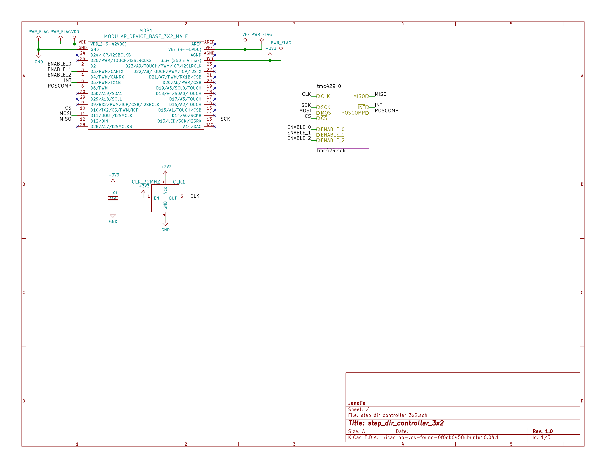
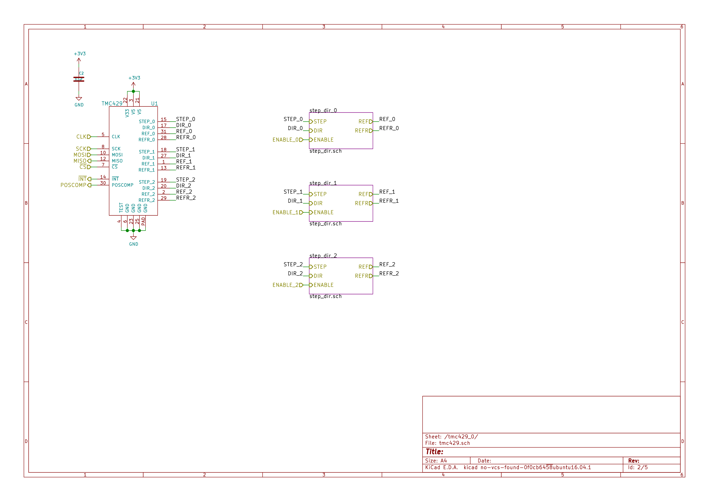
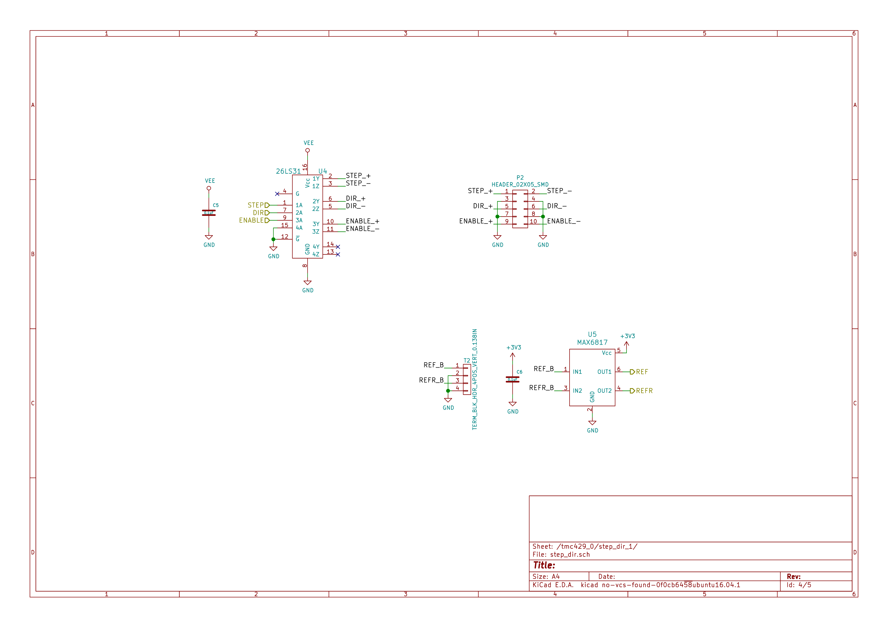

- [Repository Information](#org9af3668)
  - [Description](#org12a5327)
- [Images](#org487e4ab)
- [Schematic](#orgf3ccf35)
- [Gerbers](#org8daba14)
- [Bill of Materials](#orgb4ecbf6)
  - [PCB Parts](#orgb49a402)
  - [Supplemental Parts](#orgf877934)
  - [Vendor Parts Lists](#orgcab6291)
- [Supplemental Documentation](#org9cce4b3)
  - [Assembly Instructions](#orgffe68e8)

# Repository Information

-   **Name:** step\_dir\_controller\_3x2
-   **Version:** 1.0
-   **License:** Open-Source Hardware
-   **URL:** <https://github.com/janelia-kicad/step_dir_controller_3x2>
-   **Author:** Peter Polidoro
-   **Email:** peterpolidoro@gmail.com

## Description

This device outputs three independent sets of differential step and direction signals to control motion of actuators using step and direction drivers.

# Images

# Schematic

[./schematic/step\_dir\_controller\_3x2.pdf](./schematic/step_dir_controller_3x2.pdf)

# Gerbers

Send gerbers zip file to your favorite PCB manufacturer for fabrication.

[./gerbers/step\_dir\_controller\_3x2\_v1.0.zip](./gerbers/step_dir_controller_3x2_v1.0.zip)

# Bill of Materials

## PCB Parts

| Item | Reference(s)            | Quantity | PartNumber        | Vendor  | Description                               |
|---- |----------------------- |-------- |----------------- |------- |----------------------------------------- |
| 1    | C1 C2 C3 C4 C5 C6 C7 C8 | 8        | 399-13229-1-ND    | digikey | CAP CER 0.1UF 100V X7R 1210               |
| 2    | CLK1                    | 1        | CTX277LVCT-ND     | digikey | OSC XO 32.000MHZ HCMOS TTL SMD            |
| 3    | MDB1                    | 2        | S1011E-16-ND      | digikey | 16 Position Header Through Hole Male Pins |
| 4    | P1 P2 P3                | 3        | S9185-ND          | digikey | CONN\_HEADR\_2.54MM\_10POS\_GOLD\_SMD     |
| 5    | T1 T2 T3                | 3        | 277-5738-ND       | digikey | TERM BLOCK HDR 4POS VERT 3.5MM            |
| 6    | U1                      | 1        | 1460-1071-1-ND    | digikey | IC MOTOR CONTROLLER SPI 32QFN             |
| 7    | U2 U4 U6                | 3        | 296-1010-1-ND     | digikey | IC QUAD DIFF LINE DRIVER 16-SOIC          |
| 8    | U3 U5 U7                | 3        | MAX6817EUT+TCT-ND | digikey | IC DEBOUNCER SWITCH DUAL SOT23-6          |

## Supplemental Parts

| Item | Quantity | PartNumber   | Vendor  | Description                      |
|---- |-------- |------------ |------- |-------------------------------- |
| 1    | 3        | S9286-ND     | digikey | CONN SOCKET IDC 10POS W/KEY GOLD |
| 2    | 1        | MC10F-100-ND | digikey | CBL RIBN 10COND TWIST-PAIR 100FT |
| 3    | 3        | 277-2418-ND  | digikey | TERM BLOCK PLUG 4POS STR 3.5MM   |
| 4    | 3        | 277-5811-ND  | digikey | TERM BLOCK PLUG 4POS 90DEG 3.5MM |
| 5    | 3        | 609-4042-ND  | digikey | CONN D-SUB HD PLUG 15POS STR     |
| 6    | 3        | 609-4045-ND  | digikey | CONN D-SUB HD RCPT 15POS STR     |
| 7    | 3        | 367-1139-ND  | digikey | CONN BACKSHELL DB9 PLASTIC       |

## Vendor Parts Lists

[./bom/digikey\_parts.csv](./bom/digikey_parts.csv)

[./bom/supplemental\_digikey\_parts.csv](./bom/supplemental_digikey_parts.csv)

# Supplemental Documentation

## Assembly Instructions

-   Solder surface mount and through hole components onto the pcb.
